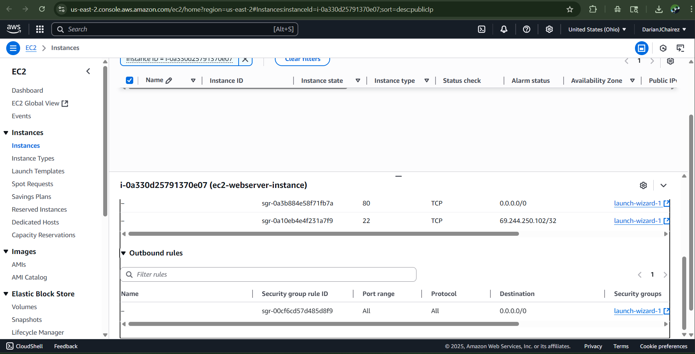
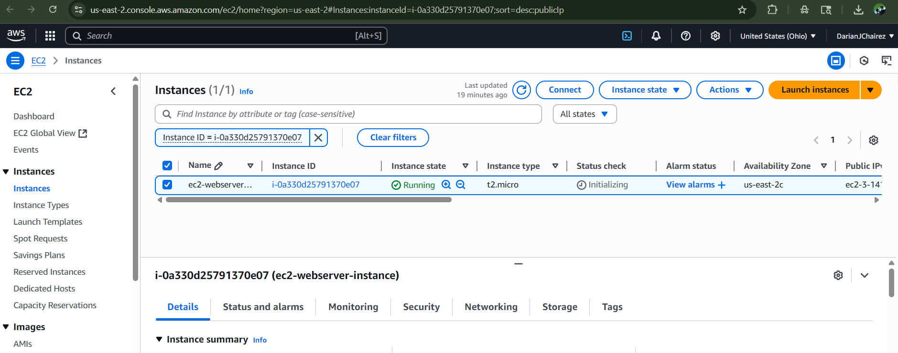

# ☁️ EC2 Apache Web Server Deployment

## Overview
This project demonstrates how to launch and configure a secure EC2 instance using Amazon Linux 2 to host a live Apache web server. It showcases foundational cloud infrastructure skills, including SSH access, server provisioning, and custom HTML deployment. This setup simulates hosting a static website in the cloud and reinforces cloud networking, permissions, and Linux package management.

## Architecture
- **Amazon EC2** for virtual server hosting and public web access
- **Apache (httpd)** for serving a custom HTML page
- **Security Groups & Key Pair** for SSH access and public HTTP permissions

## Deployment Steps
1. **Created EC2 instance** with Amazon Linux 2 and a new key pair (`Jayce.pem`)
2. **Configured Security Group** to allow inbound SSH (port 22) and HTTP (port 80)
3. **SSH’d into the instance** using PowerShell and secure `.pem` authentication
4. **Installed Apache** via `yum`, enabled the service, and deployed a custom `index.html`
5. **Tested the live site** via browser using the public IP address

## 📸 Screenshot

### Home Page or Primary View

## 🔍 Configuration Snapshots

### Security Group Inbound Rules

### EC2 Instance Details

## Outcome
This project provided hands-on experience provisioning a virtual machine in AWS and serving content over the internet using Apache. It solidified my understanding of SSH-based authentication, Linux system administration, EC2 networking (Security Groups), and basic web server hosting. I now have a solid foundation for deploying static content in cloud environments, and can confidently spin up future infrastructure-backed projects.
