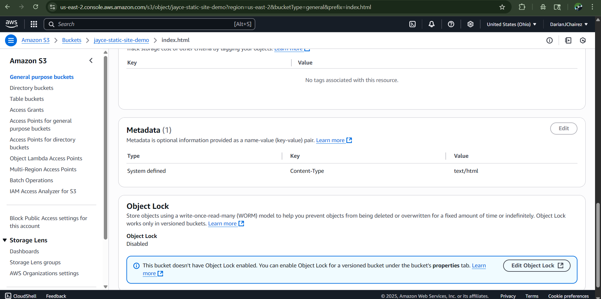

# ☁️ AWS Static Website Hosting

## Overview
This project showcases how to deploy a static website using **Amazon S3**, including how to configure public access, set metadata for proper HTML rendering, and troubleshoot character encoding issues.

## Architecture
- **Amazon S3** for static site hosting and object storage
- **IAM** for bucket policy access
- *(CloudFront not applied on final deployment URL, but can be integrated as a performance layer)*

## Deployment Steps
1. Created an S3 bucket and enabled static website hosting
2. Uploaded HTML/CSS files saved with UTF-8 encoding
3. Set `Content-Type` metadata to `text/html` on `index.html`
4. Applied a bucket policy to allow public read access
5. Validated live rendering via S3 website endpoint

## 🔗 Live Site
[Visit the deployed site](https://jayce-static-site-demo.s3.us-east-2.amazonaws.com/index.html)

## 📸 Screenshot

### Home Page

## 🔍 Configuration Snapshots

### Bucket Policy

### Metadata Panel for `index.html`

## Outcome
A lightweight, publicly accessible static website hosted on S3, with correct content rendering due to proper MIME type configuration and character encoding. Demonstrates AWS fundamentals: bucket setup, public access configuration, and metadata tuning.

## Tools Used
- AWS S3  
- IAM  
- HTML / CSS  
- GitHub for version control  
- Windows 11 (for local testing and screenshot capture)
